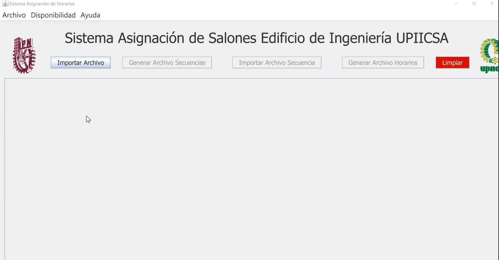
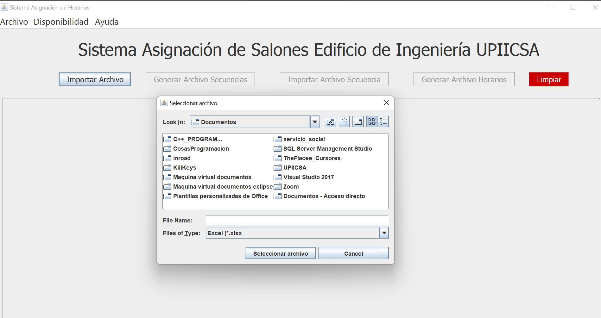
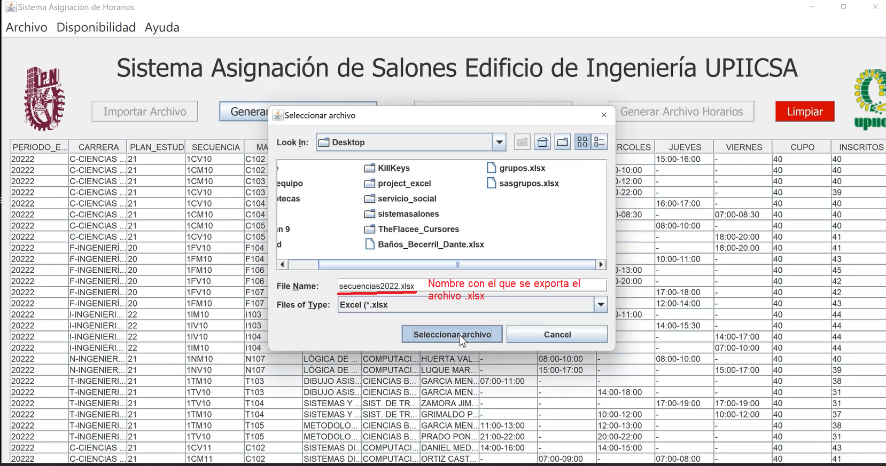
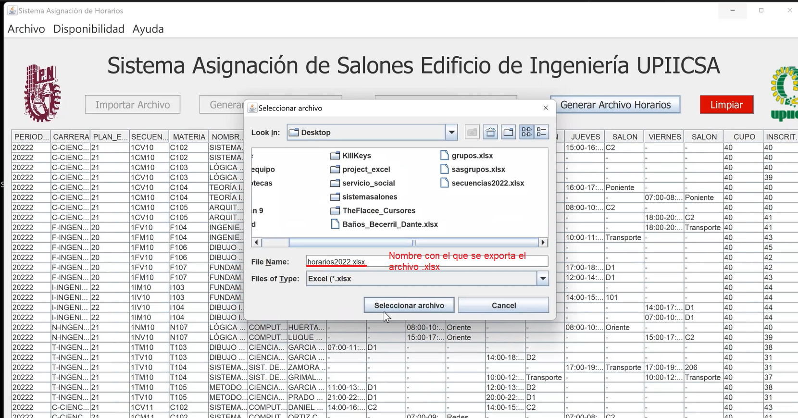
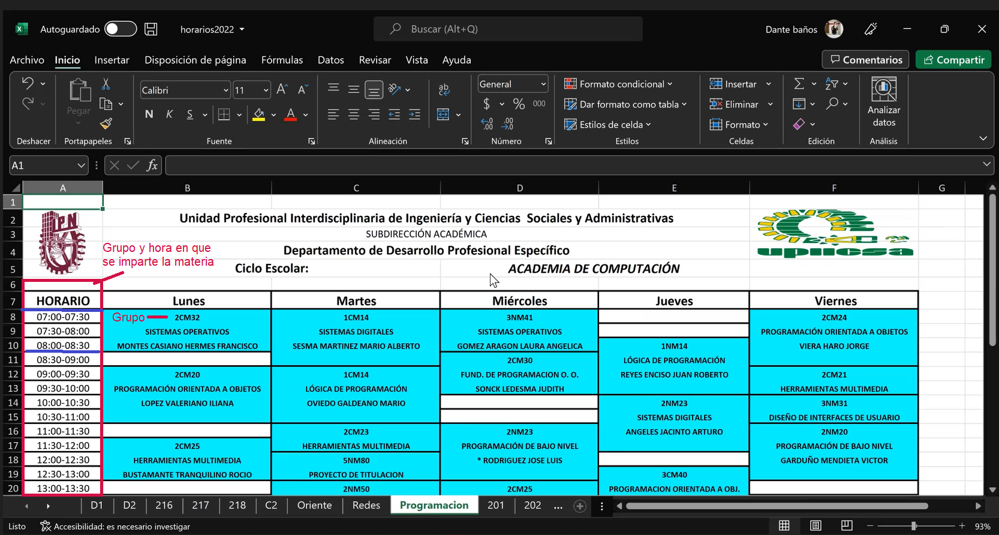

<h1 align="center"> Sistema de Asignación de salones para UPIICSA </h1>

## Descripción del proyecto 📝 
Sistema que asigna un salón a cada grupo de manera automática
tomando en cuenta la hora en la que se imparte la materia , piso y academia
para así evitar el translape entre las mismas. De esta manera se logró eificientar el proceso
con el que se trabajaba anteriormente en esta institución educativa Universitaria en México CDMX
## Tecnologías empleadas
* Java 16.0.2
* Netbeans
* Swing
* Maven
*Apache POI

### ***Capturas del proyecto***
###### Inicio 

###### Importar 

###### Archivo importado 

###### Generar Salones 

###### Salones generados por día para cada grupo 

###### Generar horario excel para cada salón  

###### Excel generado 

